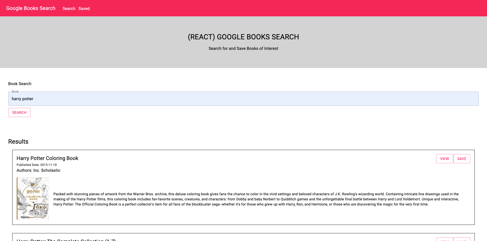
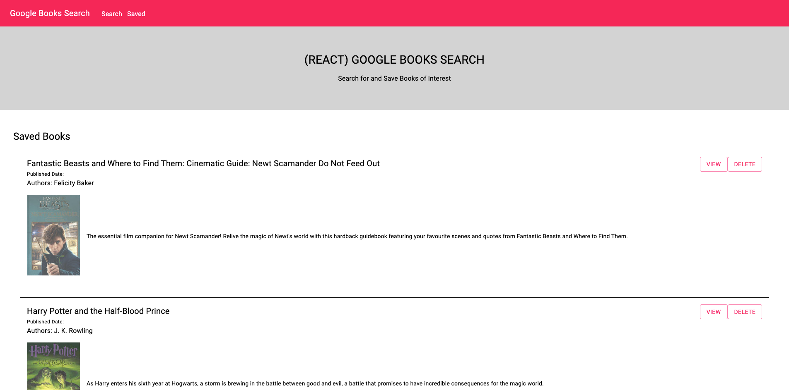

# google-books-search

## Description

Google book search app that uses the google books api to fetch book data when searched. Books can then be save into a mongodb and then rendered on the saved page.

## Technologies Used

- React.js
- Javascript
- Node.js
- Express.js
- Material UI
- Axios
- Mongoose
- MongoDB
- Heroku deployment

## Table of Contents

- [google-books-search](#google-books-search)
  - [Description](#description)
  - [Technologies Used](#technologies-used)
  - [Table of Contents](#table-of-contents)
  - [Screenshot](#screenshot)
    - [Search](#search)
    - [Saved](#saved)
  - [Deployment](#deployment)
  - [Installation](#installation)
  - [Contribute](#contribute)
  - [Questions](#questions)

## Screenshot

### Search

### Saved

## Deployment

[Heroku Deployment](https://osu-google-books.herokuapp.com/)

## Installation

Using the terminal, clone the repository to your local device using SSH or HTTPS. Once cloned, open repository in a text editor to make changes.

## Contribute

Please refer to [Contributor Covenant](https://www.contributor-covenant.org/version/2/0/code_of_conduct/) for contribution guidelines

## Questions

Created by: [Youngin9210](https://github.com/Youngin9210)

For any further information or questions please contact me at [kyleyoung.9210@gmail.com](mailto:kyleyoung.9210@gmail.com)
